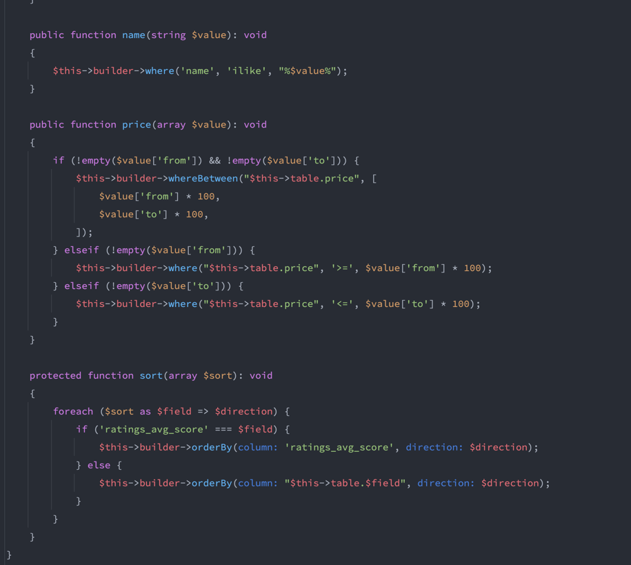

Installation
````
docker compose up
make db-migrate
make db-seed
````
Використав SOLID принципи об'єктноорієнтованого програмування, які допомагають створювати гнучкий, зрозумілий та легкий у підтримці код.


```
Single Responsibility Principle
Весь код винесиний по свої зоні відповідальності.
```

```
Open/Closed Principle 
Це не використано, тут потрібно використовувати зовнішні апі або змінювати логіку для ролей користувачв
```

```
Liskov Substitution Principle
Можна замінити репозиторії, використовувади будь яку базу даних без зміни бізнес логіки.
```

```
Interface Segregation Principle
Логіка повʼязана з обчислення статистики винесена в окремі класи, без перенавантаження основного сервіса підписок.
```
```
Dependency Inversion Principle
Вся бізнес логіка працює тільки з інтерфейсами репозиторіїв.
```


В майбутньому потрібно в репозиторії, де метод пагінації, коли застосовується фільтр, використати окремий FilterClass для винесення туди складної логіки формування запита.
Зараз виглядає як каша, не естетично й не дуже читальні.
</br>
Як на скрині


